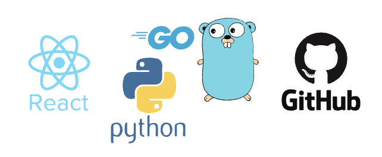

# 技術紹介

<a href="index">

## 目次

- [目次](#目次)
- [使用技術](#使用技術)
- [製作物](#製作物)

## 使用技術

### バックエンド言語

- Go
- Python

### フロントエンド言語

- JavaScripy (React, Node)

### 関係データベース管理

- PostgreSQL
- MySQL

### ソースコード管理 / コンテナ仮想化環境構築

- Github (コマンドライン)
- Docker

### OS

- Mac
- Ubuntu
- Windows

### その他の言語

- C++ (Atcoder)
- Swift
- HTML / CSS
- Java
- TypeScript

| 説明 | 言語 / 技術 |
| ---- | ---- |
|自学や講義で用いた程度 | Swift, Java, TypeScript|
|詳しい人に教えてもらいながら, ある程度扱える | Docker |
|ある程度調べつつ, 自分で扱える | Go, JavaScript, SQL, HTML / CSS, Github |
|言語を使いこなし, 最新技術やシステム側の実装も把握 | Python |

## 製作物

- [JPHACKS2022 というハッカソン](https://github.com/jphacks/D_2212)

- [Slackの履歴管理ツール](https://github.com/ixa0909/manage-slack-history)

- [Web スクレイピングについて独自にまとめたもの](https://github.com/ixa0909/webScrape)

- [製作物に用いた技術を伝えたい！](https://github.com/ixa0909/technologyFigure)

- [サポーターズ主催の定期ハッカソン](https://github.com/schezo817/localCuisine)

- [todo アプリ](https://github.com/ixa0909/tutorial)
公開先 Web ページ → https://ixa0909.github.io/tutorial/
この製作物については主に Web 上の記事を基に作成しています. 

- [深層学習を用いたアプリ](https://github.com/ixa0909/predict-tcgcard-pricechange)
製作途中 (諸事情によりコードは非公開)

- [競輪結果予測](https://github.com/ixa0909/job_hunting)
データの取得については主に Web 上の記事を基に作成しています. リポジトリの <code>README.md</code> に参考文献を記載しています. 

- [構想段階](https://github.com/ixa0909/collatz)
構想段階のものです. TypeScript のアウトプットを目的としています. 